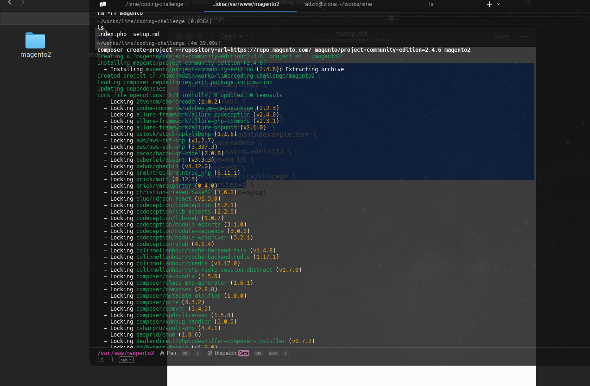
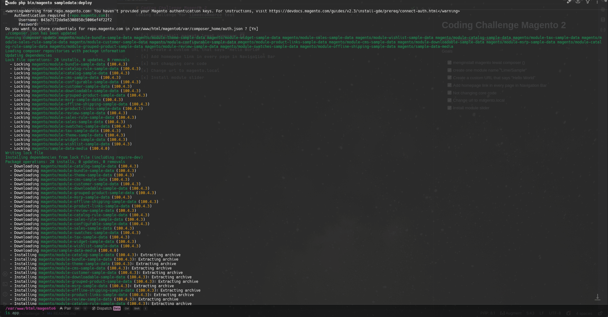
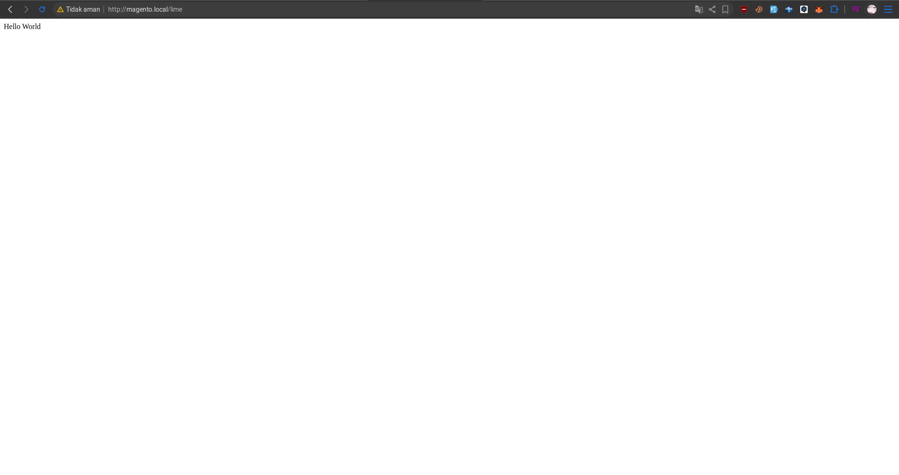
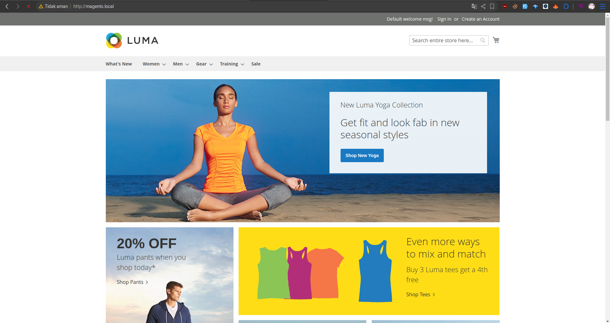
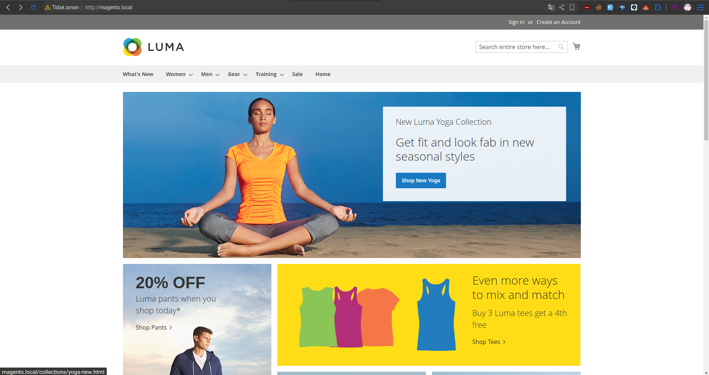
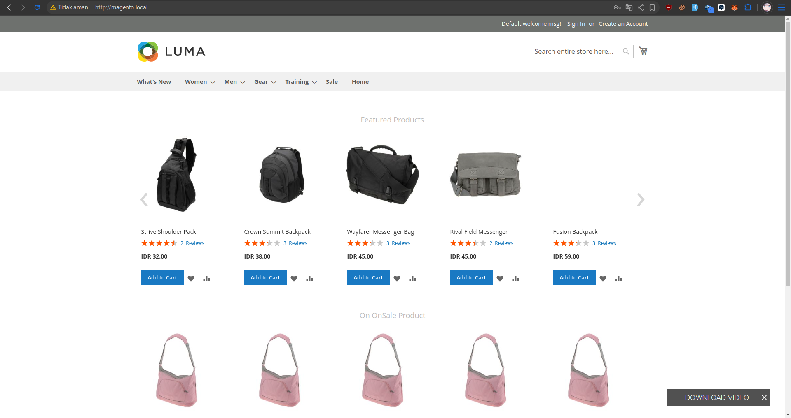
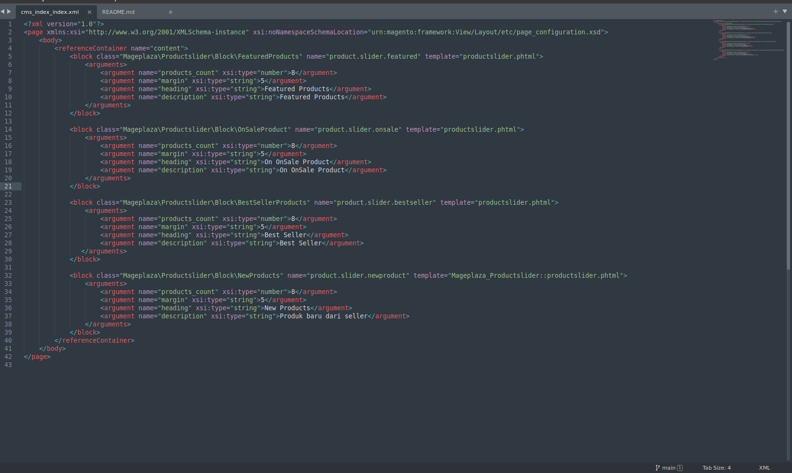

# Coding Challenge Magento 2
Coding challenge for limeecommerce test

## Goals
- [x] Installing magento via composer
- [x] create one module name "Lime/Sample" 
- [x] Create a custom URL that says "Hello World"
- [x] Add homepage link in every page in Navigation Bar
- [x] Not changing core code
- [x] Change url to magento.local
- [x] Install module slider

### Installing via Composer

### Use Sample data

### Create a custom URL "Hello World"

### Use magento.local as domain

### Add "home" on Navigation Bar 

### Featured Homepage

## Installing Magento 
